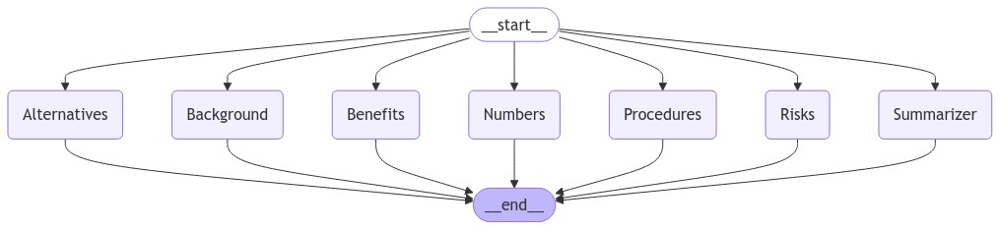

# Clinical Trial Accelerator
#### J. Michael Dean and Jeeva Poongavanam
---
Clinical trials are complex and time-consuming to implement.  Academic researchers must develop comprehensive grant proposals,
send them to a funding agency such as the National Institutes of Health (NIH), undergo a review process that may take up to two 
years, and then are expected to implement their study almost immediately after funding is provided.  For industry funded research,
time is money because of the time frame for patent protection of successful products.  

Research coordinators are often untrained in clinical medicine, and protocols are complex for them to fully understand.  Funded
investigators and funding agencies, however, are often frustrated by perceptions that the coordinating center is too slow
in starting their project:

  <table>
    <tr>
      <td></td>
      <td></td>
    </tr>
  </table>

## Demo Project Problem Statement

Human research protection programs (HRPP) require multiple steps to be accomplished before a clinical trial can begin, in order
to assure that human research subjects are protected from inappropriate risks (compared to potential benefits) of participating
in the trial.  One of the important steps that must be accomplished by the coordinator is to read and interpret the complex
protocol, and write an understandable informed consent form (ICF).  This must be accomplished before the other HRPP requirements
can be met.  Converting a 75 page protocol into a 15 page ICF is complicated by regulatory requirements for multiple components
of the ICF.  Developing the initial draft of an ICF usually requires 2 to 3 weeks effort from the coordinator, followed by 
review and corrections by the investigator, with a total process that may require another month (or more).

## Demo Project Solution

The Clinical Trial Accelerator allows the coordinator to upload the protocol document, embeds the protocol and creates a Qdrant 
vectorstore, and then utilizes large language models to write each component of the ICF.  Using LangGraph allows us to have
the components written in parallel, as shown in this workflow:

    <table>
    <tr>
      <td></td>
    </tr>
  </table>

Using this parallel workflow, a complete ICF draft that required two week of coordinator effor is produced in 15 seconds by our application.

## Future Directions
The three immediate directions for this project are:
- Create project checklist for DCC staff;  this will form the first draft of the formal project workplan that the DCC team will follow throughout implementation.
- Create site initiation checklist for all sites; this will be the first draft for the DCC coordinator staff who have to on-board the clinical sites.
- Create a QA Chatbot for the protocol, allowing DCC staff and site staff to ask questions and receive reasonably reliable information from the protocol.  The primary goal of this chat bot will be to increase the understanding of the protocol by coordinators.
